# 🚀 DevOps Microservices Platform  
**End-to-End DevOps | Kubernetes | CI/CD | Blue-Green | Observability | Resilience**
---

## 📌 Project Overview

This project demonstrates a **real-world DevOps implementation** for a microservices-based backend platform, focusing on **production readiness**, not just deployment.

The project covers:
- Zero-downtime deployments
- Safe rollbacks
- Kubernetes orchestration
- CI/CD automation
- Observability and metrics
- Load testing and resilience
- Autoscaling behavior and analysis

> It mirrors how DevOps is actually practiced in real engineering teams.

---

## 🧱 Architecture Overview

## Arc Diagram

**Microservices**
- Auth Service  
- Orders Service  
- Payments Service  
- Notifications Service  

**High-Level Flow**
## Client
→ Kubernetes Service
→ Pod (Blue / Green Deployment)

Each service is:
- Independently containerized
- Deployed via CI/CD
- Managed by Kubernetes
- Observable through metrics

---

## 🛠 Technology Stack

- **Backend:** FastAPI (Python)  
- **Containerization:** Docker  
- **Orchestration:** Kubernetes (AKS)  
- **CI/CD:** GitHub Actions  
- **Deployment Strategy:** Blue-Green  
- **Monitoring:** Prometheus, Grafana  
- **Load Testing:** k6  
- **Autoscaling:** Kubernetes HPA  

---

## 🔵 Phase 0 — Environment & Foundations

**Goal:** Never struggle with setup again

**What was done**
- Linux CLI workflow
- Git branching and commits
- Python virtual environments
- Docker fundamentals

**Outcome**
- Clean, reproducible development environment
---

## 🔵 Phase 1 — Backend Microservices

**Goal:** Understand service behavior and boundaries

**What was done**
- Multiple FastAPI services
- Independent APIs
- Async request handling
- Clear service separation

**Outcome**
- All services respond correctly
- APIs are independently deployable

## Screenshots

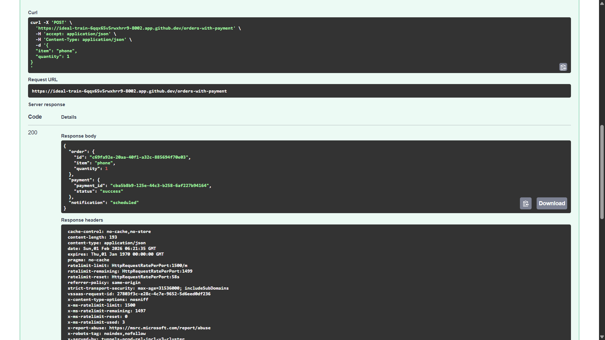

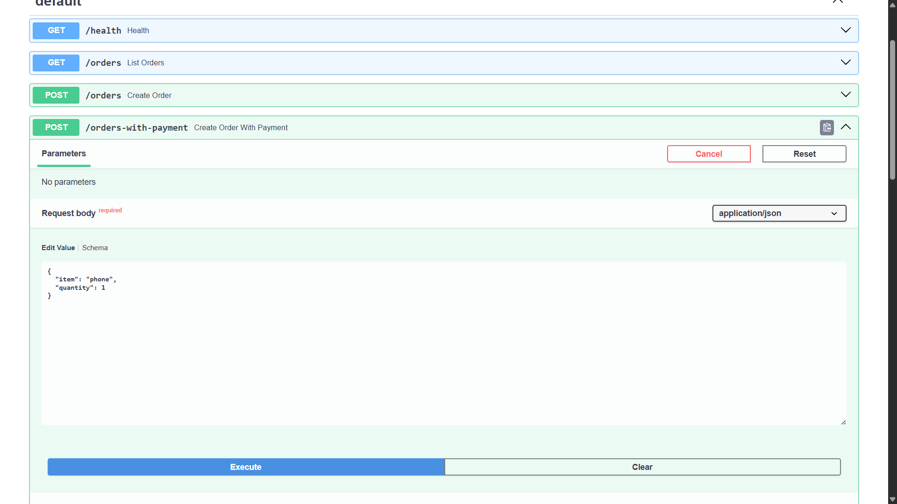

---

## 🔵 Phase 2 — Dockerization

**Goal:** Application runs identically everywhere

**What was done**
- Dockerfile per service
- Environment-based configuration
- Docker Compose for local orchestration

**Outcome**
- Full system starts with a single command
- Zero manual setup steps
---

## 🔵 Phase 3 — Kubernetes Core

**Goal:** Production-grade orchestration

**What was done**
- Kubernetes Deployments and Services
- Namespace isolation
- ConfigMaps and Secrets
- Declarative infrastructure

**Outcome**
- All services run inside Kubernetes
- Fully declarative cluster setup

## Screenshots

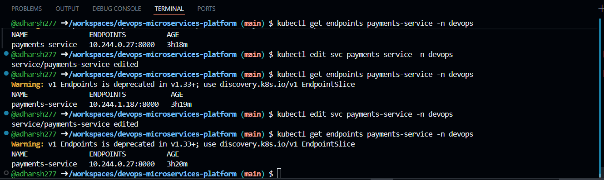
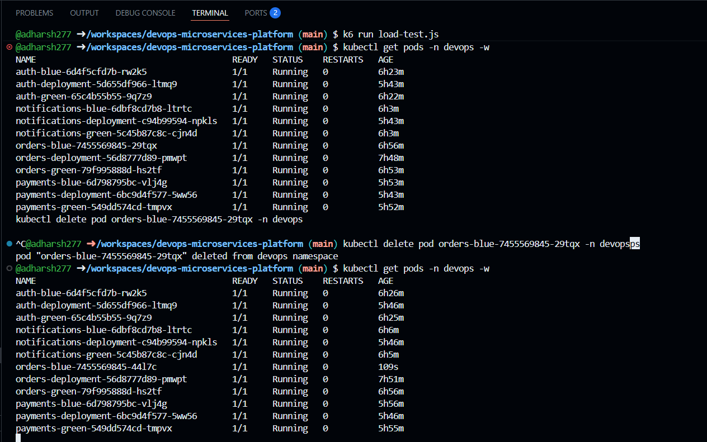
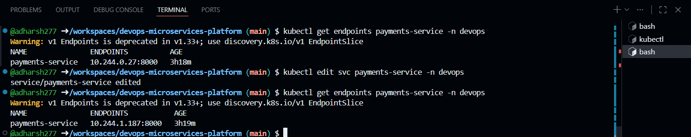

---

## 🔵 Phase 4 — CI/CD & Blue-Green Deployment

**Goal:** Zero-downtime deployments

**What was done**
- GitHub Actions CI/CD pipelines
- Image build and push on commit
- Automated Kubernetes deployments
- Blue-Green deployments for all services
- Instant rollback via service selector switch

**Why Blue-Green**
- No downtime
- Safe releases
- Fast rollback during incidents

**Outcome**
- One-click deployments
- Rollback in seconds

## Screenshots

### GitHub Actions pipeline runs
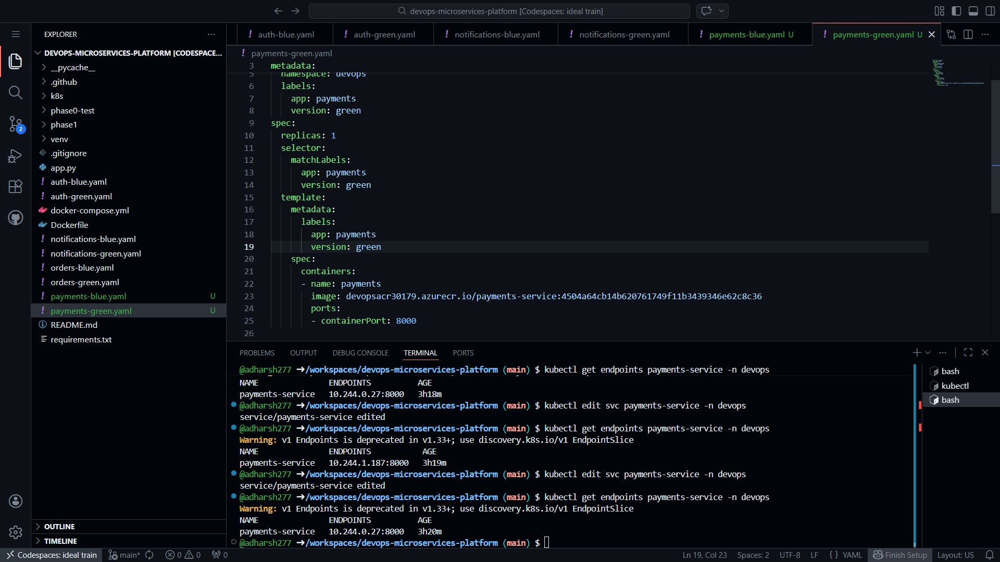

### Blue–Green Deployment Traffic Switch
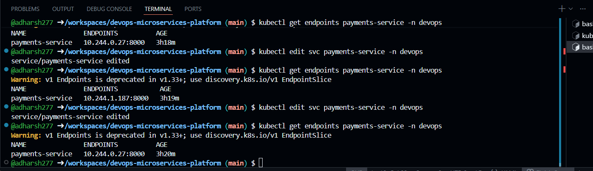

---

## 🔵 Phase 5 — Observability

**Goal:** See failures before users do

**What was done**
- Prometheus metrics collection
- Grafana dashboards
- Metrics validation under load

**Outcome**
- CPU, memory, and pod metrics visible
- System behavior measurable

## Screenshots
### Grafana dashboards
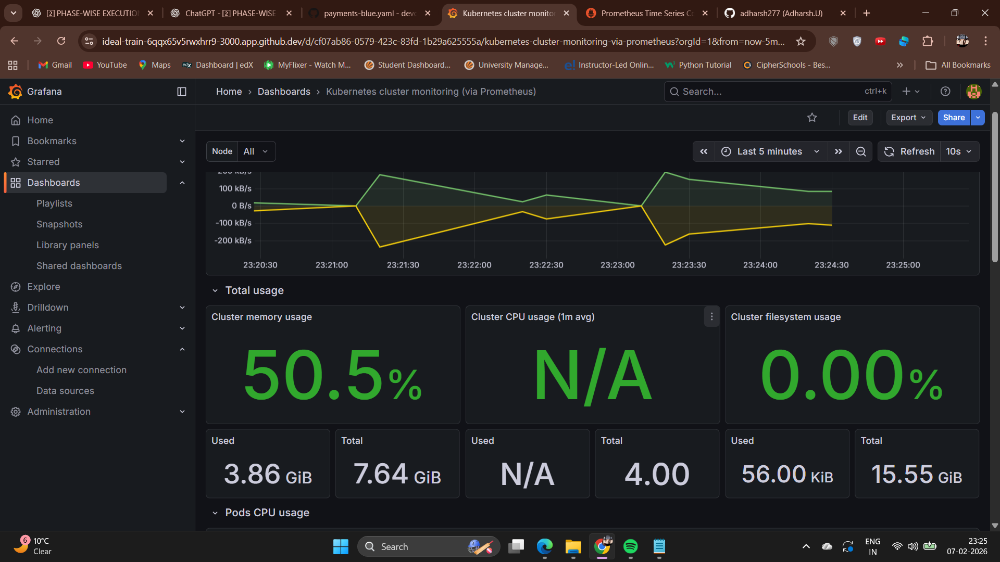

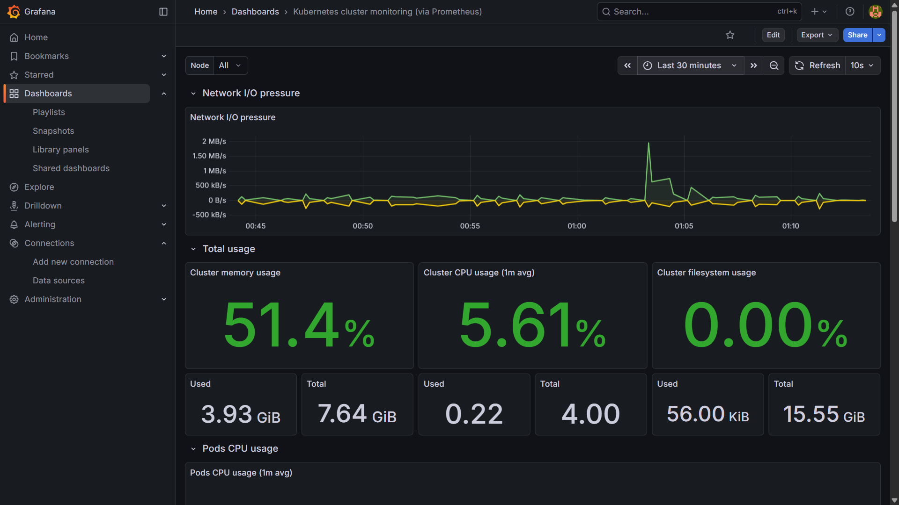

### Prometheus metrics
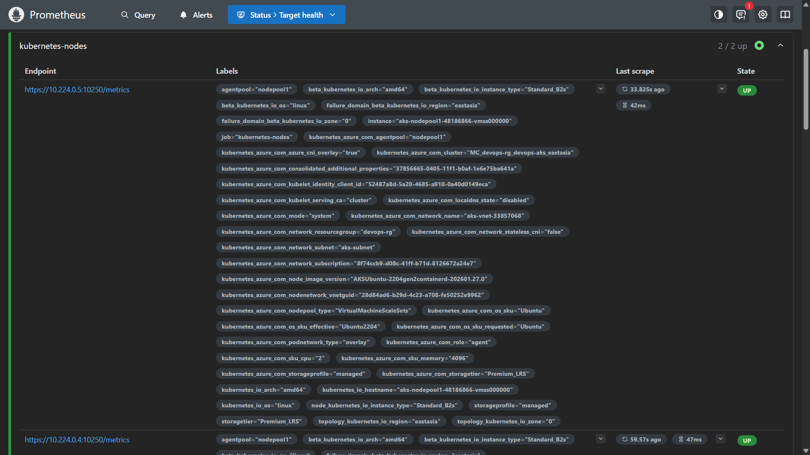

▶️ **Grafana dashboards Explained**  
[Watch the video](assets/github.mp4)

---

## 🔵 Phase 6 — Backup & Disaster Recovery (Design)

**Goal:** Disaster recovery strategy

**What was evaluated**
- Velero for Kubernetes backups
- Object-storage-based restore model

**Design Decision**
- Platform is stateless
- No databases or persistent volumes
- Full DR execution intentionally deferred

**Why**
- Stateless workloads rely on redeploy, not restore
- Design clarity is more important than forced demos

**Outcome**
- DR approach clearly understood and documented
- Clear upgrade path for future stateful workloads

---

## 🔵 Phase 7 — Load, Failure & Resilience

### Load Testing
- k6 used to generate concurrent traffic
- Latency and error rates measured
- System remained stable under load

## Screenshots
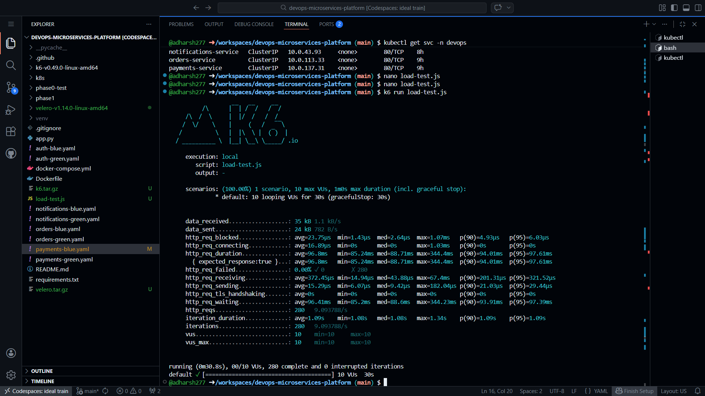

---

### Autoscaling (HPA)
- CPU-based Horizontal Pod Autoscaler configured
- Metrics validated
- Correct non-scaling behavior explained
  (service was not CPU-bound)

**Key Insight**
> Autoscaling should happen only when resource pressure exists.
> 
---

### Pod Failure Simulation
- Live pods deleted manually
- Kubernetes self-healing observed
- No service disruption

---

## 🎯 Key Learnings

- Zero-downtime is about process, not just tools
- Observability is mandatory in production
- Autoscaling must be driven by metrics, not assumptions
- Knowing **when not to scale** is critical
- DevOps is decision-making, not tool collection

---
## 🏁 Final Status

✅ Project Complete  
🚀 Production-oriented DevOps platform  

**Author:** Adharsh U  

## 📄 Research Paper

This research paper was prepared as part of the design and evaluation of this DevOps platform.

**Title:** Blue–Green and Canary Deployments in Cloud-Native DevOps  
**Format:** PDF  
[View Research Paper](research/blue-green-canary-devops.pdf)

